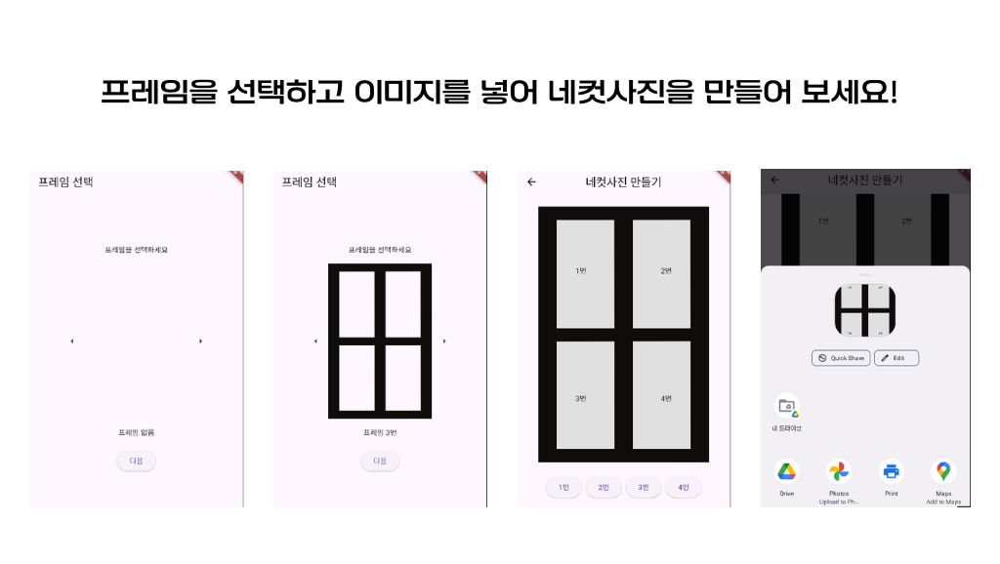

# 🎞️ life_photo_app

Flutter 기반의 인생네컷 프레임 앱입니다.  
사용자가 4장의 사진을 선택하여 인생네컷 스타일로 꾸밀 수 있습니다.

---

## 📱 주요 기능

- PNG 프레임 위에 사진 4장 배치
- 사진 크기 조절 기능
- 결과물 공유 기능

---

## 🚀 사용법

1. 앱을 실행하고 프레임을 선택하세요.
2. 각 칸을 눌러 사진을 업로드하세요.
3. 사진 위치를 조절하거나 확대/축소할 수 있어요.
4. [공유] 버튼을 눌러 결과물을 공유하세요.

---

## 🛠️ 개발 환경

- Flutter 3.x
- Dart
- Android/iOS 지원
- 사용 패키지:
  - `image_picker`
  - `permission_handler`
  - `path_provider`
  - `share_plus`

---

## 🧾 코드 구조 및 설명

```plaintext
lib/
├── main.dart                         # 앱 진입점
└── screens/
    ├── FrameSelectionScreen.dart     # 프레임 선택 화면
    └── home_screen.dart              # 사진 편집(삽입/조절/공유) 메인 화면
``` 

### 📌 주요 파일 설명

- **main.dart**  
  앱의 시작점이며, `MaterialApp`을 통해 초기 화면을 설정합니다.  
  기본 라우팅 및 테마 설정이 이루어집니다.

- **screens/FrameSelectionScreen.dart**  
  사용자가 원하는 인생네컷 프레임 이미지를 선택하는 화면입니다.  
  선택된 프레임 경로를 `HomeScreen`으로 전달합니다.

- **screens/home_screen.dart**  
  선택한 프레임 위에 사진 4장을 배치하고 조정하는 기능을 담당하는 핵심 UI 화면입니다.  
  사진 선택, 확대/축소, 저장 및 공유 기능이 구현되어 있습니다.

---

## 📸 스크린샷



---

## 📚 참고 자료

- [Flutter 공식 문서](https://docs.flutter.dev/)
- [Flutter Codelab](https://docs.flutter.dev/get-started/codelab)
